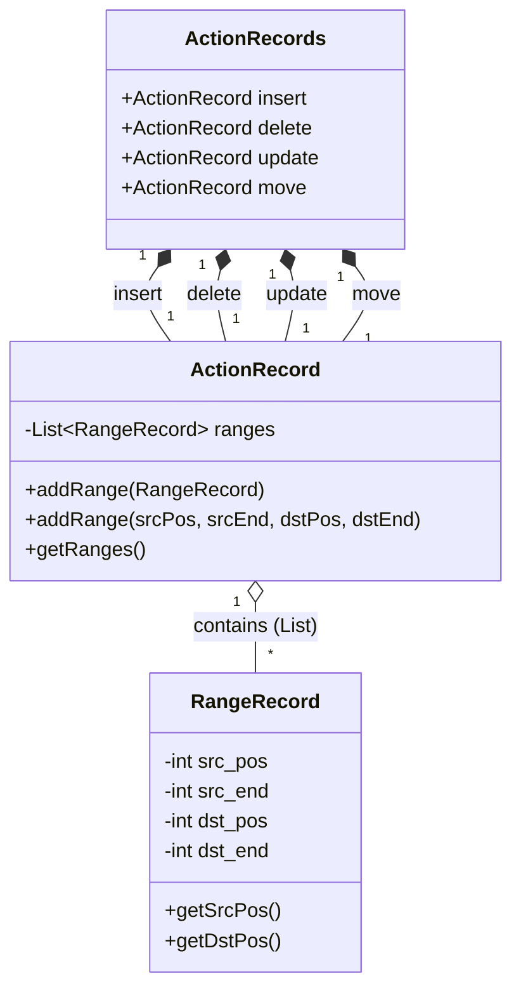

# LGMatcherJsonExporter

[LGMatcher](https://github.com/kusumotolab/LGMatcher)のソースコードを利用。
`Gradle 4.10.3`(古い)が、新しいJavaではセキュリティ上禁止されている内部的な機能を使おうとして、Java側からブロックされていたため、GradleとJavaのバージョンは引き上げた。
___

LGMatcherSampleを元に作成。
JSON出力器だが内部の`ActionRecords`型は汎用的に利用できる。
ファイルの先頭からの文字数を保管している．

## setup

jdk17でのみコンパイル可能
```
./gradlew shadowJar
```

## how to use - CUI
LGMatcherの計算方法で計算
```
java -jar LGMatcherJsonExporter-1.0-all.jar [-LGM] [出力先ファイル名] [srcPath] [dstPath]
```

既存のGumTreeの計算方法で計算
```
java -jar LGMatcherJsonExporter-1.0-all.jar [-M] [出力先ファイル名] [srcPath] [dstPath]
```

例
```
java -jar LGMatcherJsonExporter-1.0-all.jar -LGM data.json ./A.java ./B.java
```

## how to use - In Java Project

```java
GumTreeRunner GTR = new GumTreeRunner("./A.java","./B.java");
//GTR.setUseLGMatcher(false); //LGMatcherを使うか否か
GTR.run();

ActionRecords actionRecords = ActionConverter.makeActionRecords(GTR.getActions(), GTR.getmapping());
```

## `ActionRecords`型について
`ActionRecords`は`ActionRecord`のコンテナである．
`ActionRecord`は`RangeRecord`のコンテナである．
`RangeRecord`はファイルの先頭からの文字数を保管する．



<details> <summary> 処理メモ </summary>

1. `GumTreeRunner.run()`でGumTreeの`List<Action> actions`と`MappingStore`を生成
	- `GumTreeRunner.setUseLGMatcher(false)`でLGMatcherを使わなくできる
2. `ActionConverter.makeActionRecords(...)`で`ActionRecords`に変換
3. `ActionRecordsJsonExporter.toJson(...)`で`JSONObject`に変換


</details>

<details> <summary> `update`の粒度の向上メモ </summary>

- `update`の粒度が粗いことがあった
	- 例: `3 + 5`を`3 - 5`に変更すると変えたのは1文字なのに5文字書き換えた判定に
	- 原因 : InfixExpressionのような、子ノードを持つ&ノード自身に値を持つ ノードは、自身の文字数を子ノードの分まで含む。
	```
	Ifstatement
	└── InfixExpression : <= (このノードは2文字ではなく "w <= num_list[i-1]" の18字扱い)
		├── SimpleName : w
		└── ArrayAccess
			├── SimpleName : num_list
			└── InfixExpression : -
				├── SimpleName : i
				└── NumberLiteral : 1
	```
	- どうやら最新のGumTreeでは正確に情報を保管しているが、LGMatcher対応のoldなversionでは各ノードに細かく文字数を保管してない(っぽい。多分。)
	- 解決策 : UPDATEのみ子ノードの文字数を引く
		- 親ノードで`[10,25]`で子ノ－ドが`[10,15]`,`[19,25]`のときに`[16,18]`となるようにする
		- 現状は確認できていないが、親ノードで`[10,25]`で子ノ－ドが`[10,11]`,`[15,16]`,`[19,25]`のように、間に区間補集合が複数(`[12,14]`,`[17,18]`)ある時は前にある方の`[12,14]`となる。
		- `getTightRange`が対応

</details>

	
